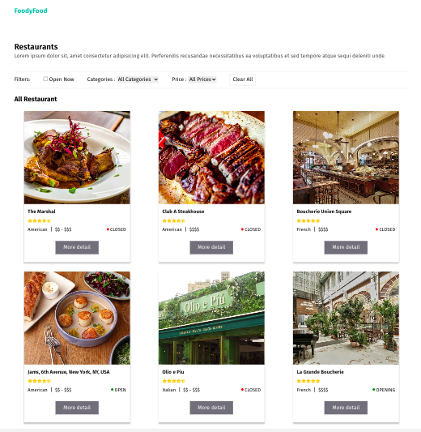
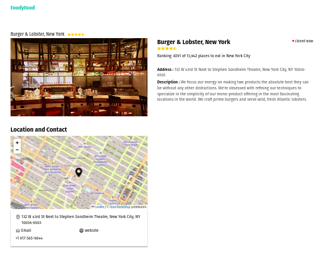

# FrontendDevReactjs-Mahdi




> ❗
> If the data does not appear, please refresh the page. The data does not want to appear for some reason maybe because it uses a free API.

Live version : https://foodyyfood.netlify.app/

### React Version

react : ^18.2.0

### Node version

node : v18.17.1

### Getting starter

- To get started with this project, run :

```bash
git clone https://github.com/mahdipratama/FrontendDevReactjs-Mahdi.git
```

- Install all dependencies :

```bash
npm install
```

- Run the project locally

```bash
npm run dev
```
